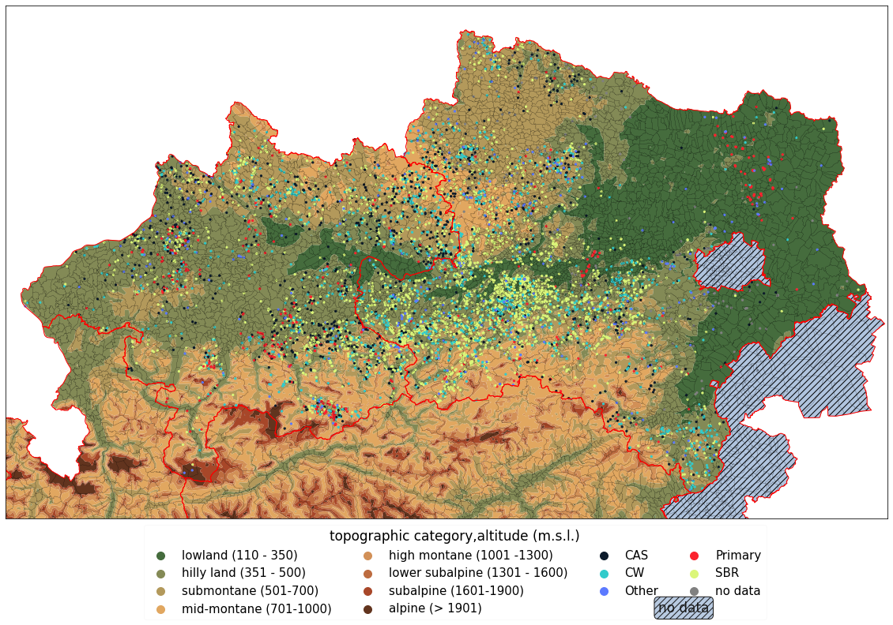
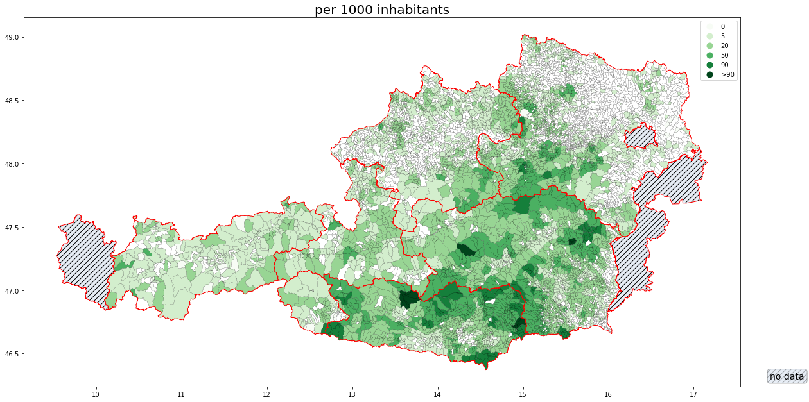
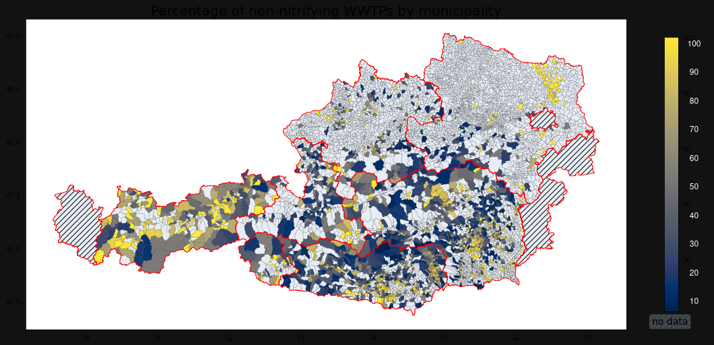

# Locating small wastewater systems in Austria

## Produced for my master thesis, my first data project

## status of code : it was my first big project, and looking at the code i can tell.
still had a static data approach with scripts working over static files.

no homogenity, order nore elegnace. just functionality

# Results

### Key Visualizations

*Relationship between topographical features and treatment plant technology distribution*  
Small wastewater plants are often located in semi-montaneous areas where larger plants are not feasible. This plot shows the distribution of treatment technologies in relation to topography.

*Percentage of population served by small WWTPs by municiplaity*  
In semi-montaneous areas, small wastewater treatment plants are prevalent. This plot shows the percentage of the population served by these infrastructures across municipalities.

*Percentage of small wastewater treatment plants without nitrification processes by municipality*

Explicit nitrification treatments are compuslory in Austria, but many small plants still lack these processes. This plot shows the distribution of non-nitrification plants across municipalities.

