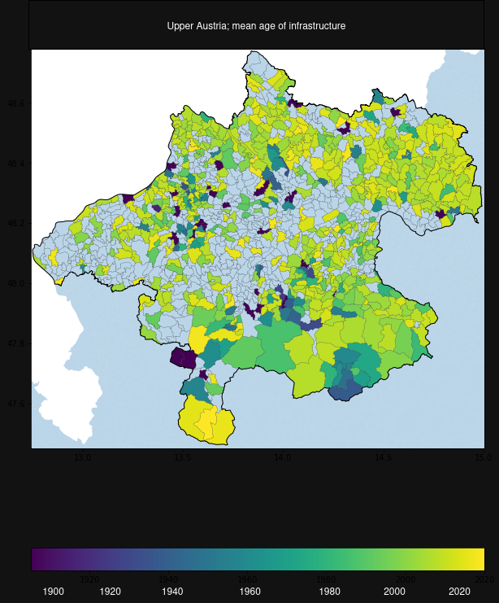
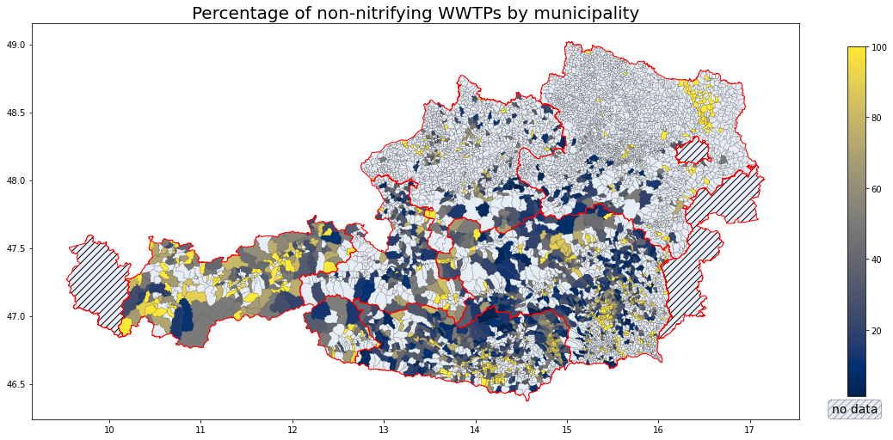
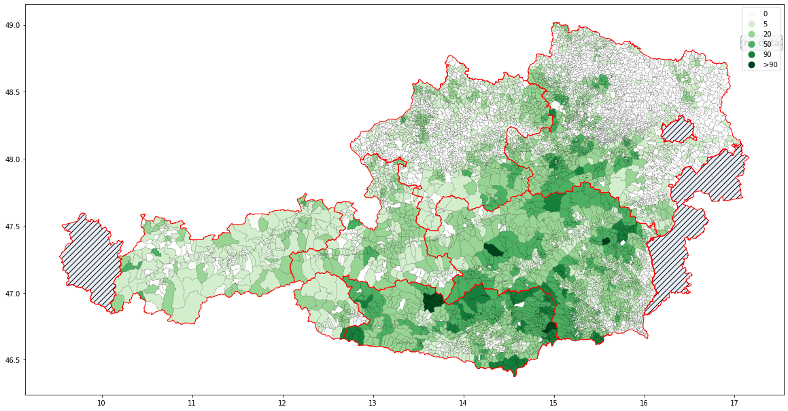

### Locating small wastewater systems in Austria

## Produced for my master thesis, my first data project

## status of code : it was my first big project, and looking at the code i can tell.
still had a static data approach with scripts working over static files.

no homogenity, order nore elegnace. just functionality

## results

### Key Visualizations

*Distribution of wastewater treatment plants by age categories*

*Percentage of wastewater treatment plants without nitrification processes across Austria*

*Population equivalents for treatment plants serving more than 1000 people*

*Relationship between topographical features and treatment plant technology distribution*

*Location and distribution of wastewater treatment plants serving more than 1000 people*

## show some graphs here which is the only good thing

